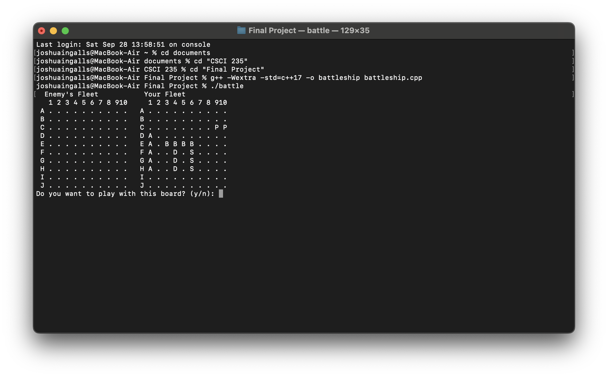
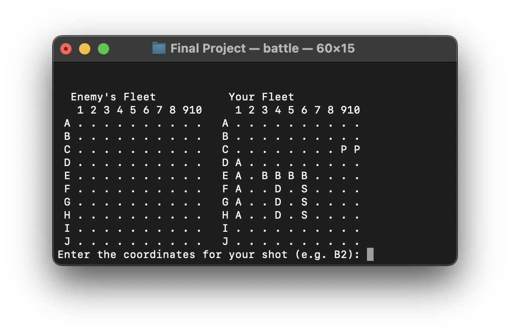

[Back to Portfolio](./)

Cyberrange Expansion for Beginners
===============

-   **Class:** CSCI 499
-   **Grade:** A
-   **Language(s):** Java, 
-   **Source Code Repository:** [Senior Project](https://github.com/ThunderboltG/CSU-Senior-Project)  
    (Please [email me](mailto:jpingalls@csustudent.net?subject=GitHub%20Access) to request access.)

## Project description

A virtual environment where Freshman/Sophomore Cybersecurity students can learn the basic principles needed for cyber competitions. Students will be able to enumerate and explore networks, navigate Command Line Interfaces, Establish Firewall rules against attacking IP

Project was guided by Dr. Julie Henderson

## How to compile and run the program

All of the Vms are currently compiled and ready to run. Start all of the VMs and log into the Windows machine

Password: csuBucs

## UI Design

The Vms run almost exclsuivly through Powershell in the project. There is use of extrernal tools such as Wireshark and Nmap

  
Fig 1. Windows Home Screen

  
Fig 2. All of the Linux VMs

## 3. Additional Considerations

The program is easily able to have additions added into the network. Additions should be considered for higher level excercises 
For more details see [Senior Project](https://github.com/ThunderboltG/CSU-Senior-Project).

[Back to Portfolio](./)
