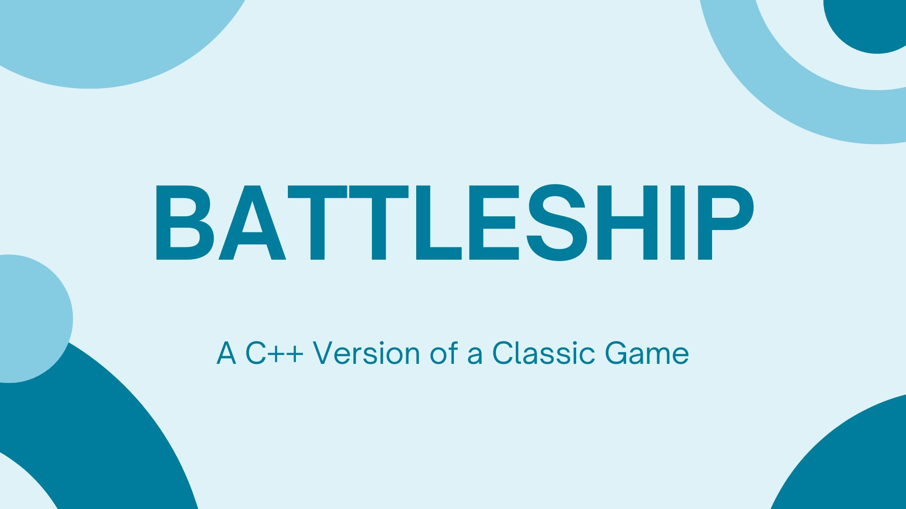
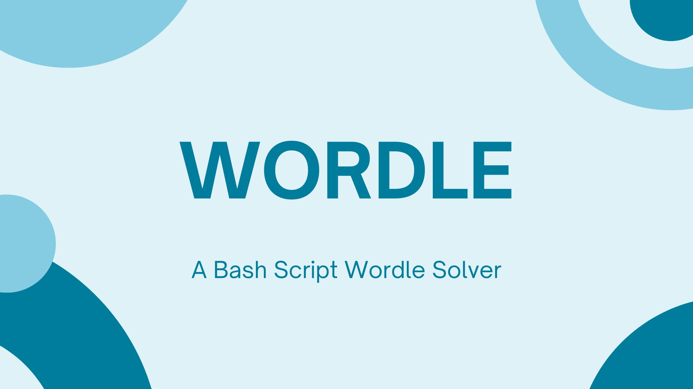
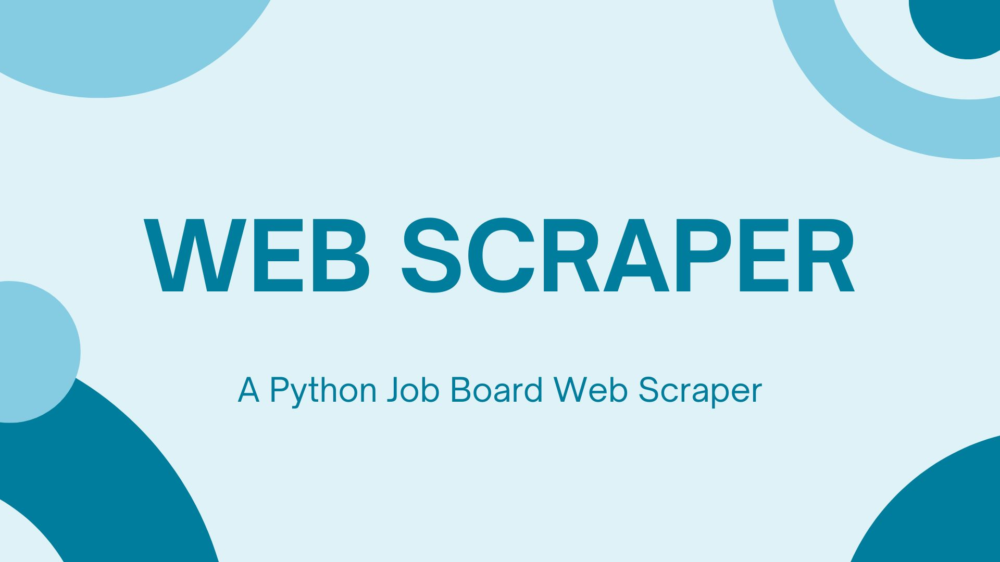
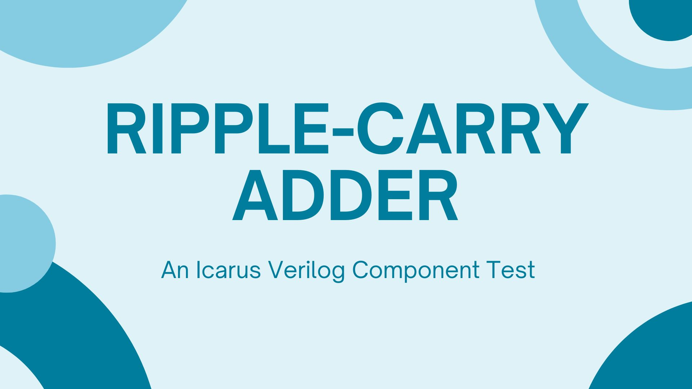

Portfolio
=========

Programming Projects
--------------------

*For access to my private project repositories, please [email me](mailto:jpingalls@csustudent.net?subject=GitHub%20Access) with the subject line, GitHub Access.

---
### [Battleship | CSCI 235](project1)

---
### [Wordle Solver | CSCI 301](project2)

---
### [Python Job Webscraper | CSCI 301](project3)

---
### [Ripple-Carry Adder | CSCI 330](project4)

---

Ethics Papers
-------------

### [The Good Hacker](/EthicsPapers/CSCI235.docx)

-   **Class:** CSCI 235: Procedural Programming
-   **Grade:** A

### [The Ethical and Legal Conerns of Memes](/EthicsPapers/CSCI330.docx)

-   **Class:** CSCI 330: Computer Architecture
-   **Grade:** B+

### [Intellectual Property in the Modern Age](/EthicsPapers/CSCI332.docx)

-   **Class:** CSCI 332: Applied Netowrking
-   **Grade:** A

---

Presentations
-------------

### [Goodwill Industries Breach](/presentations/Goodwill.pdf)

- **Class:** CSCI 405: Principles of Cybersecurity
- **Grade:** A

### [The 2020 US Government Breach](/presentations/2020USHacks.pdf)

- **Class:** CSCI 405: Principles of Cybersecurity
- **Grade:** A

---

Page template forked from <a href="https://github.com/csu-cs/csci-portfolio">CSU-CS</a>

<!-- Remove above link if you don't want to attributive -->
