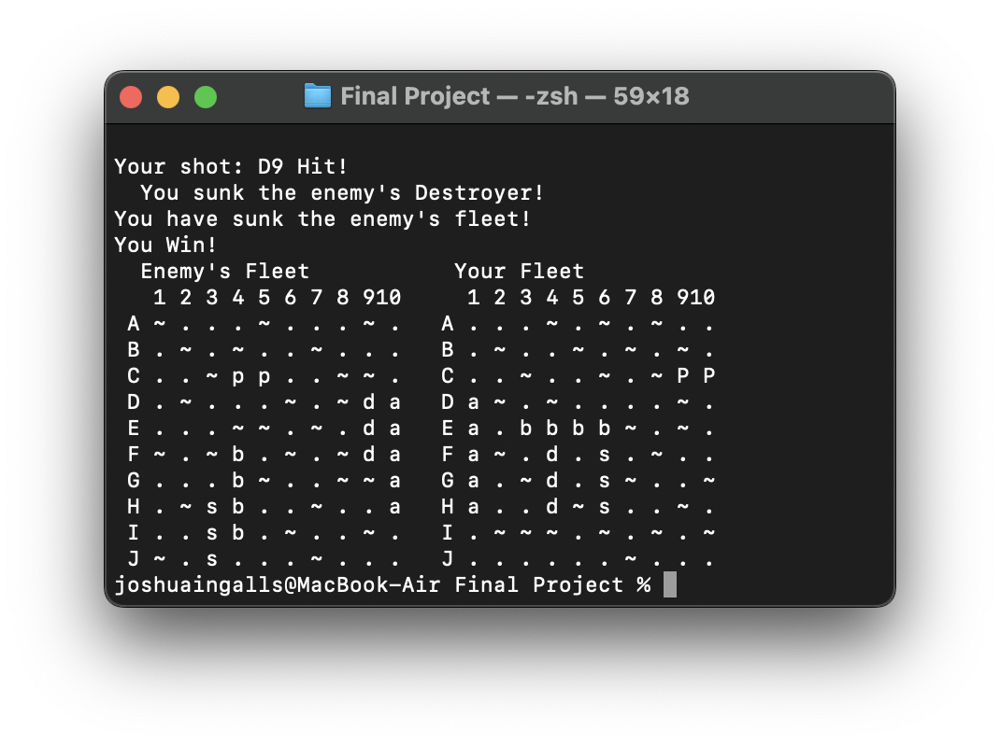

[Back to Portfolio](./)

Battleship
===============

-   **Class:** CSCI 235: Procedural Programming
-   **Grade:** A
-   **Language(s):** C++
-   **Source Code Repository:** [features/mastering-markdown](https://guides.github.com/features/mastering-markdown/)  
    (Please [email me](mailto:jpingalls@csustudent.net?subject=GitHub%20Access) to request access.)

## Project description

Battleship was the final project of CSCI 235. This program is a recreation of the classic game Battleship in C++. The code using the cli to display two 10x10 boards, stored as arrays.

## How to compile and run the program

How to compile and run the project.

```bash
g++ -Wextra -std=c++17 -o battleship Battleship.cpp
./battleship
```

## UI Design

The game is run through the CLI. The first screen is the ship randomizer. This allows the user to randomize the position of their ships before the game begins (See Fig 1). Once the user confirms their ship placement, the game begins with the user getting the first move (see Fig 2). The user and the computer will take turns shooting at different positions on the board. After each round of action, the board will display the results of both the user and the computer's turns, display the current board state, and prompt the user for their next move (see Fig 3). The game checks the validity of each move, notifiyng the user of either an invalid move or an already made move (see Fig 4 and Fig 5). Whenever the computer or the user sinks a ship, a notification appears telling what ship has been sunk (see Fig 6). Once either the computer or the user sinks all enemy ships, the board will go to the results screen. This screen reveals the ships of both boards, and states the winner of the game (see Fig 7).

Lorem ipsum dolor sit amet (see Fig 1), consectetur adipiscing elit, sed do eiusmod tempor incididunt ut labore et dolore magna aliqua. Ut enim ad minim veniam, quis nostrud exercitation ullamco laboris nisi ut aliquip ex ea commodo consequat (see Fig 2). Duis aute irure dolor in reprehenderit in voluptate velit esse cillum dolore eu fugiat nulla pariatur. Excepteur sint occaecat cupidatat non proident, sunt in culpa qui officia deserunt mollit anim id est laborum (see Fig 3).

  
Fig 1. The launch screen and ship select menu

  
Fig 2. The starting board of the game

  
Fig 3. Feedback when an invalid move occurs

  
Fig 4. Feedback when an invalid move occurs

  
Fig 5. Feedback when an already shot area occurs

  
Fig 6. Feedback when a ship is sunk

  
Fig 7. Game finished screen

## 3. Additional Considerations

Sed ut perspiciatis unde omnis iste natus error sit voluptatem accusantium doloremque laudantium, totam rem aperiam, eaque ipsa quae ab illo inventore veritatis et quasi architecto beatae vitae dicta sunt explicabo. 

For more details see [GitHub Flavored Markdown](https://guides.github.com/features/mastering-markdown/).

[Back to Portfolio](./)