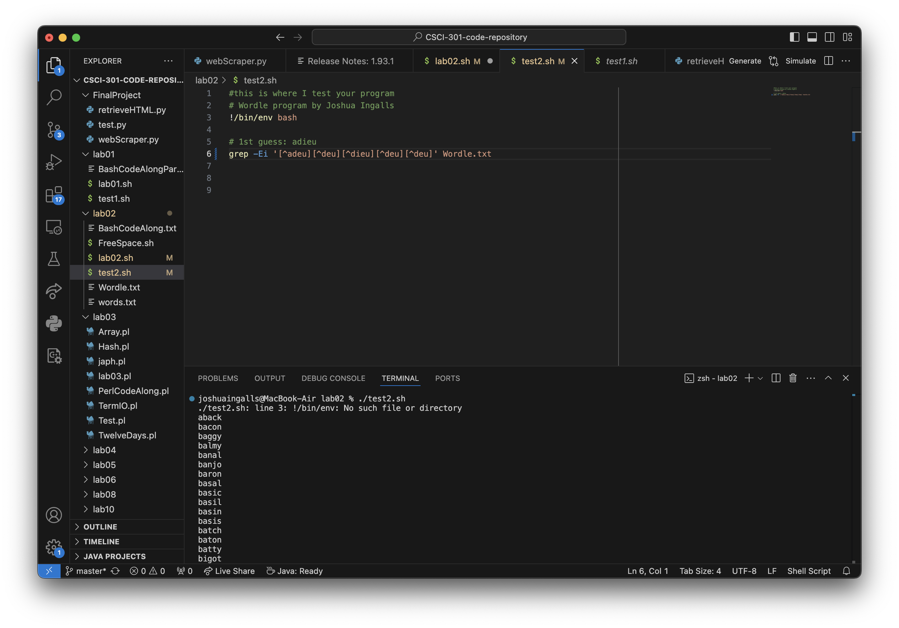
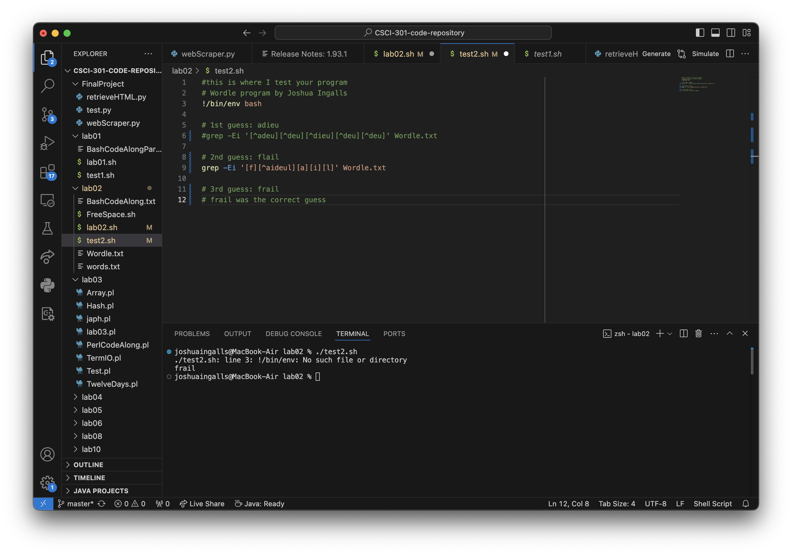
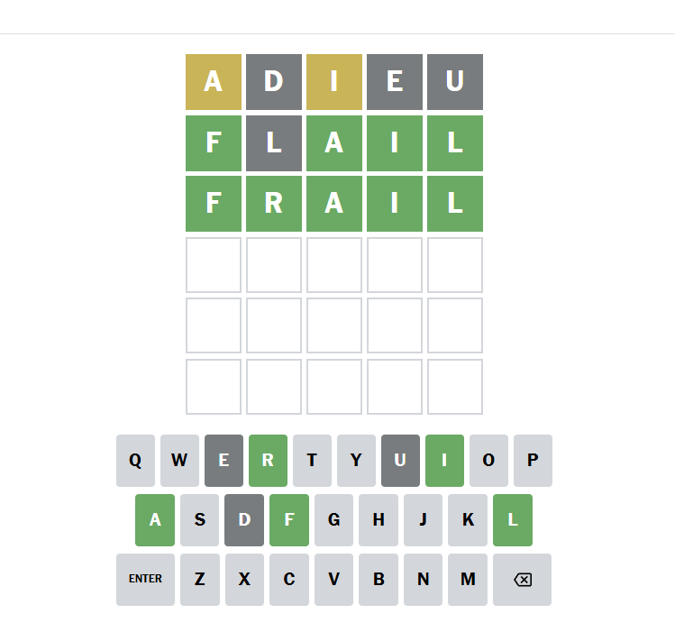

[Back to Portfolio](./)

Wordle Solver
===============

-   **Class:** CSCI 301: Survey of Scripting Languages
-   **Grade:** B
-   **Language(s):** Bash
-   **Source Code Repository:** [Wordle](https://github.com/ThunderboltG/Wordle)  
    (Please [email me](mailto:example@csustudent.net?subject=GitHub%20Access) to request access.)

## Project description

This program is designed to help the user solve the New York Times game, Wordle. By using the words list for the game, the user inputs into the grep command what letters are not possible for that letter slot. The program will then give what words are still available within the parameters. After another guess, the user inputs what new letters are not possible for each letter slot, or puts the single letter of a correct letter.

## How to compile and run the program

How to run the project.

```bash
./wordle.sh
```

## UI Design

When running the program, each word that is currently legal to the grep command will display to the CLI and start a new line (see Fig 1). After subsequent guesses, the program will return fewer words. This allows for more educated guess of the word (see Fig 2). With the help of the program, this wordle was solved in only three guesses! (see Fig 3).

  
The output from the first guess

  
Fig 2. The output of the second guess

  
Fig 3. The solved wordle

## 3. Additional Considerations

Sed ut perspiciatis unde omnis iste natus error sit voluptatem accusantium doloremque laudantium, totam rem aperiam, eaque ipsa quae ab illo inventore veritatis et quasi architecto beatae vitae dicta sunt explicabo. 

For more details see [Wordle](https://github.com/ThunderboltG/Wordle).

[Back to Portfolio](./)