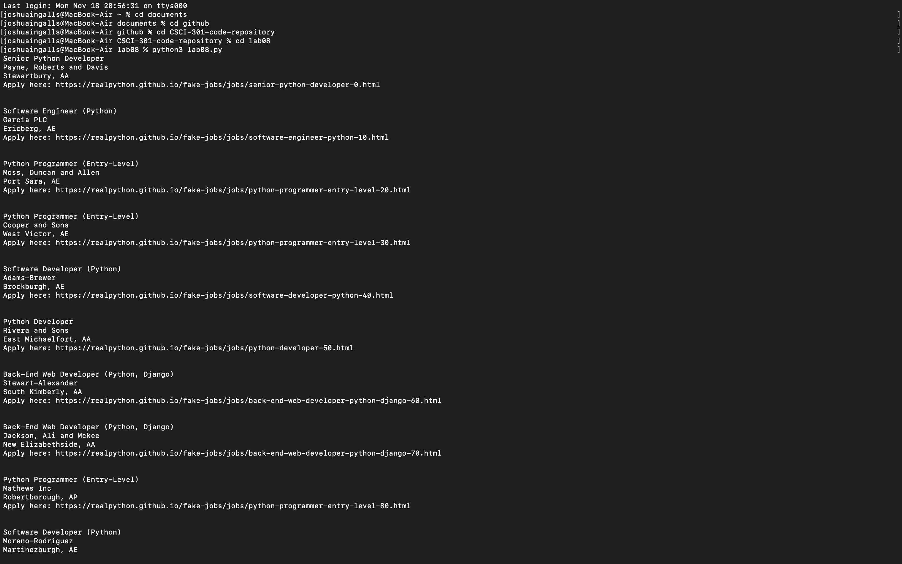

[Back to Portfolio](./)

Python Job Webscraper
===============

-   **Class:** CSCI 301: Survey of Scripting Languages
-   **Grade:** B
-   **Language(s):** Python
-   **Source Code Repository:** [features/mastering-markdown](https://guides.github.com/features/mastering-markdown/)  
    (Please [email me](mailto:example@csustudent.net?subject=GitHub%20Access) to request access.)

## Project description

This job board web scraper was designed as the final project for CSCI 301. I origionally attempted to create the scraper to find jobs off of Indeed, but I was unable to get that working porperly. Instead, i pivoted to the [Python Job Board](https://pythonjobs.github.io/). This scraper uses BeautifulSoup to analyze the HTML structure of the site to find Python jobs and retrieving the details of each job posting

## How to compile and run the program

How to compile (if applicable) and run the project.

```bash
cd ./project
python setup.py
```

If the programming language does not require compilation, the update the heading to be “How to run the program.” If your application is deployed on a remote service, including instructions on how to deploy it.

## UI Design

Almost every program requires user interaction, even command-line programs. Include in this section the tasks the user can complete and what the program does. You don't need to include how it works here; that information may go in the project description or in an additional section, depending on its significance.

  
Fig 1. The web scraper

## 3. Additional Considerations

Sed ut perspiciatis unde omnis iste natus error sit voluptatem accusantium doloremque laudantium, totam rem aperiam, eaque ipsa quae ab illo inventore veritatis et quasi architecto beatae vitae dicta sunt explicabo. 

For more details see [GitHub Flavored Markdown](https://guides.github.com/features/mastering-markdown/).

[Back to Portfolio](./)