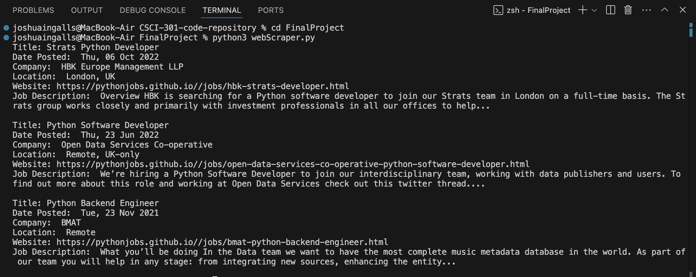

[Back to Portfolio](./)

Python Job Webscraper
===============

-   **Class:** CSCI 301: Survey of Scripting Languages
-   **Grade:** B
-   **Language(s):** Python
-   **Source Code Repository:** [Python Scraper](https://github.com/ThunderboltG/PythonScraper)  
    (Please [email me](mailto:example@csustudent.net?subject=GitHub%20Access) to request access.)

## Project description

This job board web scraper was designed as the final project for CSCI 301. I origionally attempted to create the scraper to find jobs off of Indeed, but I was unable to get that working porperly. Instead, i pivoted to the [Python Job Board](https://pythonjobs.github.io/). This scraper uses BeautifulSoup to analyze the HTML structure of the site to find Python jobs and retrieving the details of each job posting.

## How to compile and run the program

How to compile (if applicable) and run the project.

```bash
cd ./webScraper
python3 webScraper.py
```

## UI Design

The CLI brings any job posting matching the descrpition of the search. Each aspect of the job starts a new line, and blank space is found between job postings.

  
Fig 1. The web scraper

For more details see [Python Scraper](https://github.com/ThunderboltG/PythonScraper)  .

[Back to Portfolio](./)